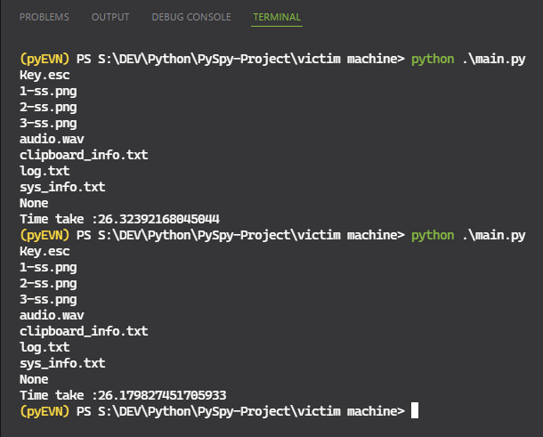
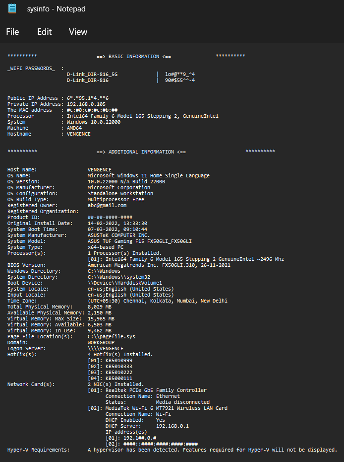
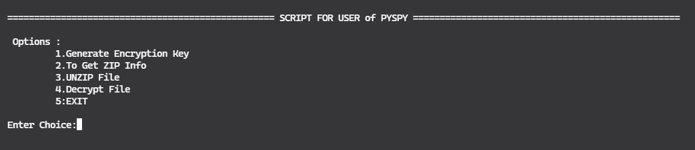
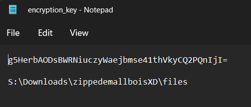
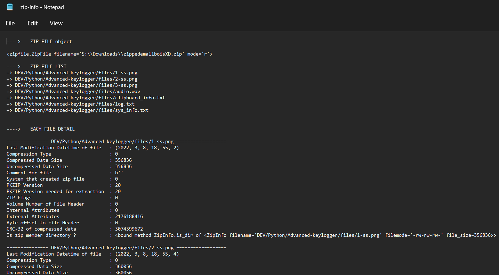

# 
 **PYSPY** 

<!-- PROJECT LOGO -->
 

  

<h3 align="center">PySPY Gallery</h3>

  

     
    <a href="https://github.com/VENGENCE7/PySPY"><strong>PYSPY »</strong></a>
     
     
    <a href="#execution-time">Execution Time</a>
    :
    <a href="#system-information">System Information</a>
    :
    <a href="#complimentary-script">Complimentary Script</a>
    :
    <a href="#encryption-key">Encryption Key Example</a>
    :
    <a href="#zip-info">Zip Info</a>
  

  
<!-- ET -->  
## Execution Time

   
  
 
  
<!-- SI -->  
## System Information
  
   
  

  
<!-- CS -->  
## Complimentary Script
  
   
  

  
<!-- EK -->  
## Encryption Key
  
  
  
  

  
<!-- ZI -->  
## Zip Info
  
   
  

  
 

[<a href="#top">Back to top</a>]

